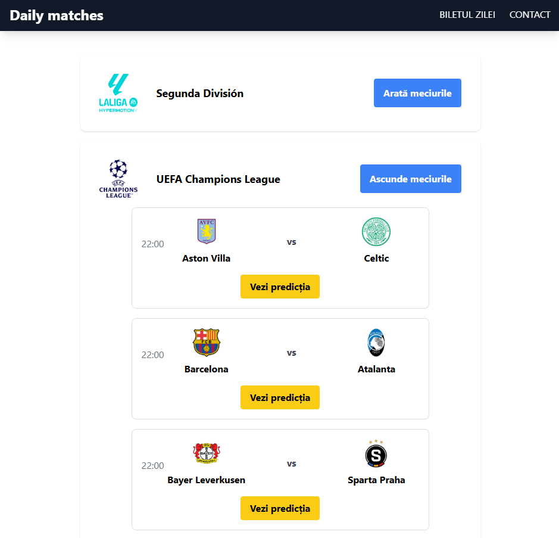
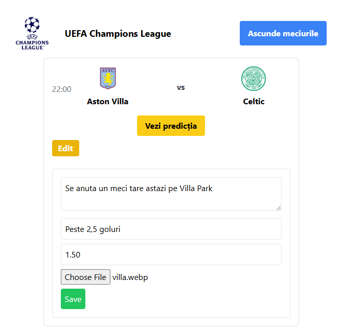
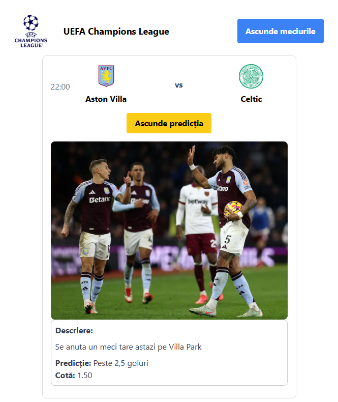
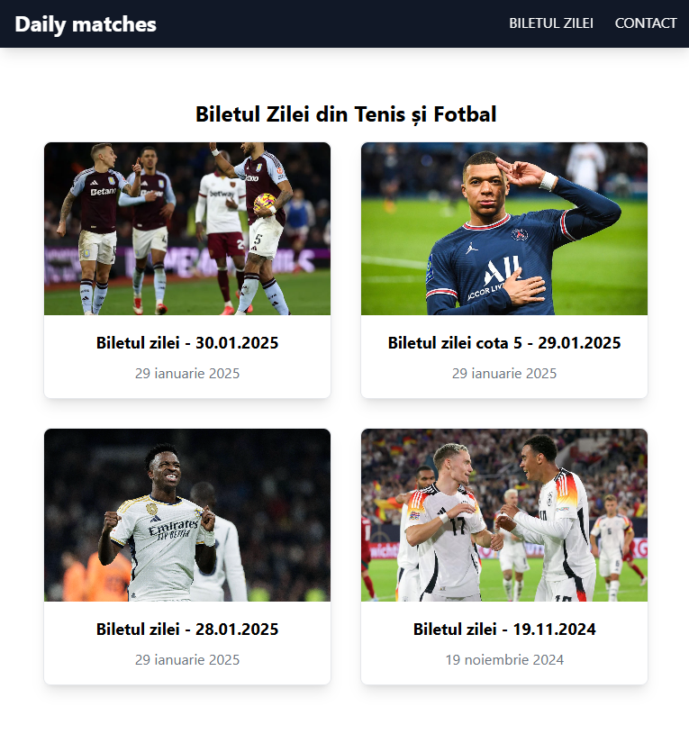

# ⚽ Football Matches - Prediction App

This is a web application for displaying football matches and adding predictions. Users can view ongoing matches, add predictions, and analyze statistics.

---

## 🚀 Features

- 🔎 **Match Viewer** – A complete list of matches from various competitions.
- 📊 **Custom Predictions** – Add predictions and odds for each match.
- 🏆 **Bet Ticket Management** – Create and manage daily betting tickets.
- 📡 **API Integration** – Data fetched from the Football API Sports.
- 🔐 **Admin Authentication** – Access to an admin panel for validating results.

---

## 🛠️ Setup and Run Locally

### 🔹 **1. Clone the Repository**
```sh
git clone https://github.com/Alexandru-Dobos/football-matches.git
cd football-matches
```

### 🔹 **2. Install Dependencies**
**Backend:**
```sh
cd backend
npm install
```

**Frontend:**
```sh
cd ../frontend
npm install
```

### 🔹 **3. Configure the `.env` File**
In the `backend/` folder, create a `.env` file and add:
```
DB_HOST=localhost
DB_USER=root
DB_PASSWORD=root
DB_NAME=matchesdata
RAPIDAPI_KEY=YOUR_API_KEY
```
In the `frontend/` folder, create a `.env` file and add:
```
REACT_APP_API_URL=http://localhost:3000
```

### 🔹 **4. Run the Application**
**Backend:**
```sh
cd backend
node server.js
```
**Frontend:**
```sh
cd ../frontend
npm start
```

---

## 📸 Screenshots

### Homepage



### AddPredictionPage (back)



### AddPredictionPage (front)




### TicketsPage



---

## 📜 License
This project is open-source and can be freely used and modified.

---

## 🙌 Contributions
If you have suggestions or improvements, feel free to create a pull request! 😊

